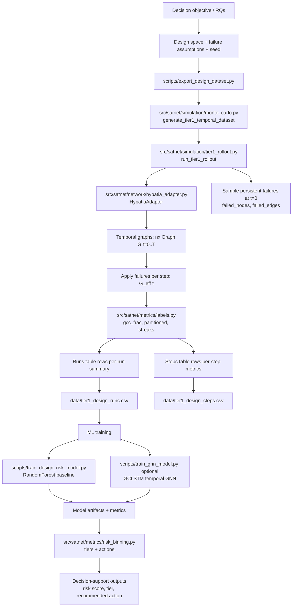
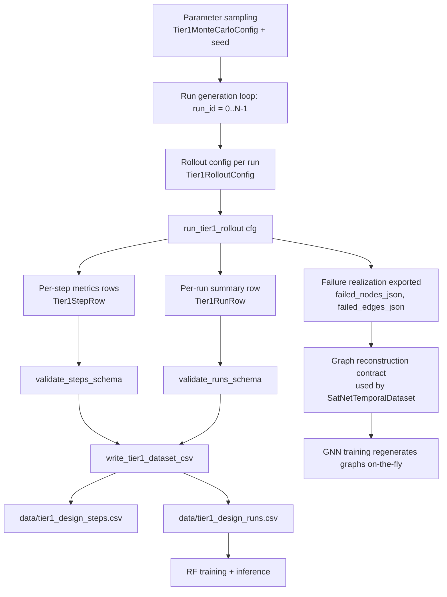
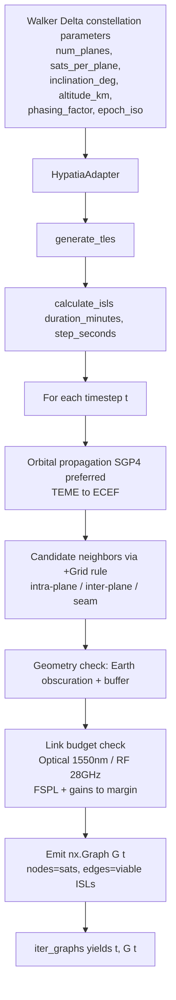
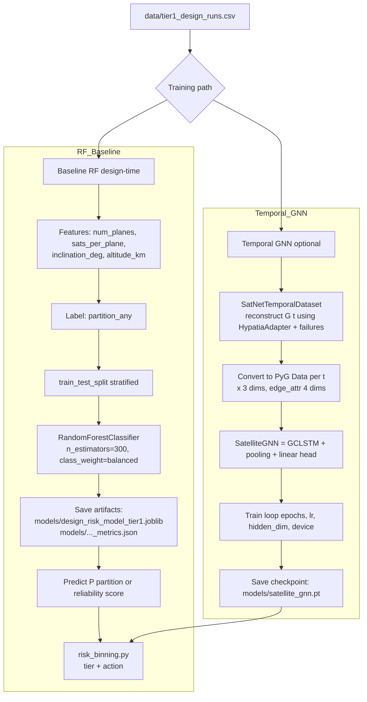

# SatNet DSS Technical Flowcharts

**Date:** 2026-01-21  
**Author:** Auto-generated from codebase analysis  
**Version:** Tier 1 Phase 1

---

## Overview

This document contains technical flowcharts describing the satnet-arch-dss pipeline. The flowcharts are organized into:

1. **High-Level End-to-End Process** — The complete decision-support loop
2. **Data Usage (Detailed)** — Dataset generation, validation, and export
3. **Constellation Buildout (Detailed)** — Physics-based temporal ISL graph construction
4. **ML Model Training (Detailed)** — Baseline RF and optional temporal GNN

All flowcharts are in Mermaid format for rendering in GitHub, VS Code, or any Mermaid-compatible viewer.

---

## Flowchart 1 — Entire Process (High-Level)

---

## Flowchart 2 — Data Usage (Detailed)

---

## Flowchart 3 — Satellite Constellation Buildout (Detailed, Phase 1)

---

## Flowchart 4 — ML Model Training (Detailed)

---

## Segment Breakdown — What / Why / How

### 1. Space Segment

| Aspect | Description |
|--------|-------------|
| **What** | The orbital layer of the system: LEO satellite constellation with Inter-Satellite Links (ISLs) forming a dynamic mesh network in space. |
| **Why** | Provides global, low-latency connectivity independent of terrestrial infrastructure. ISLs enable routing without ground hops, reducing latency and increasing resilience. |
| **How** | Walker Delta constellation pattern defines satellite placement. SGP4 propagates orbits over time. +Grid topology rule determines ISL neighbors. Link budgets (optical 1550nm / RF 28GHz) validate connectivity. |
| **Code** | `src/satnet/network/hypatia_adapter.py` → `HypatiaAdapter`, `WalkerDeltaConfig` |
| **Status** | ✅ Implemented (Phase 1) |

---

### 2. Build Satellite Constellation

| Aspect | Description |
|--------|-------------|
| **What** | Programmatic generation of a Walker Delta constellation with configurable parameters: number of planes, satellites per plane, inclination, altitude, and phasing factor. |
| **Why** | Enables rapid design-space exploration. Different configurations yield different coverage, capacity, and resilience profiles. Reproducibility via `epoch_iso` and `seed`. |
| **How** | 1) Define `WalkerDeltaConfig` with orbital parameters. 2) Generate TLEs for each satellite. 3) Propagate positions via SGP4. 4) Compute ISLs using geometry checks + link budgets. 5) Emit `nx.Graph` per timestep. |
| **Code** | `src/satnet/network/hypatia_adapter.py` → `generate_tles()`, `calculate_isls()`, `iter_graphs()` |
| **Status** | ✅ Implemented (Phase 1) |

---

### 3. Develop and Train ML Model

| Aspect | Description |
|--------|-------------|
| **What** | Machine learning models that predict network partition risk from constellation design parameters or temporal graph sequences. Two models: RF baseline (design-time) and GCLSTM (temporal GNN). |
| **Why** | Enables proactive risk assessment before deployment. RF baseline uses only design features → fast, interpretable. GCLSTM captures temporal dynamics → higher fidelity for runtime prediction. |
| **How** | **RF:** Train `RandomForestClassifier` on `[num_planes, sats_per_plane, inclination_deg, altitude_km]` → predict `partition_any`. **GNN:** `SatNetTemporalDataset` reconstructs graph sequences on-the-fly → `SatelliteGNN` (GCLSTM + pooling) classifies Robust vs Partitioned. |
| **Code** | `src/satnet/models/risk_model.py`, `src/satnet/models/gnn_model.py`, `src/satnet/models/gnn_dataset.py` |
| **Status** | ✅ Implemented |

---

### 4. Simulations and Testing

| Aspect | Description |
|--------|-------------|
| **What** | Monte Carlo simulation framework that generates temporal rollouts under varying failure conditions. Persistent node/edge failures sampled at t=0, applied across all timesteps. |
| **Why** | Produces statistically meaningful datasets for ML training. Captures the full distribution of failure scenarios. Deterministic seeds ensure reproducibility. |
| **How** | 1) `Tier1MonteCarloConfig` defines parameter ranges + number of runs. 2) For each run, sample constellation + failure params. 3) `run_tier1_rollout()` executes temporal simulation. 4) Collect per-run summaries + per-step metrics. 5) Validate schema + export CSVs. |
| **Code** | `src/satnet/simulation/monte_carlo.py`, `src/satnet/simulation/tier1_rollout.py`, `scripts/export_design_dataset.py` |
| **Status** | ✅ Implemented |

---

### 5. Analyze Results

| Aspect | Description |
|--------|-------------|
| **What** | Metrics computation and risk binning. Pure functions calculate GCC fraction, partition status, and streak aggregation from graph state. Risk binning translates continuous scores to actionable tiers. |
| **Why** | Labels must be **non-leaky** — derived only from graph topology, not failure parameters. Risk tiers (Healthy/Watchlist/Critical) provide actionable decision support for operators. |
| **How** | 1) `compute_gcc_frac(G)` → fraction of nodes in largest connected component. 2) `compute_partitioned(G, threshold)` → boolean partition flag. 3) `aggregate_partition_streaks(steps)` → temporal aggregates. 4) `bin_satellite_risk(score, thresholds)` → tier + recommended action. |
| **Code** | `src/satnet/metrics/labels.py`, `src/satnet/metrics/risk_binning.py` |
| **Status** | ✅ Implemented |

---

### 6. Ground Segment

| Aspect | Description |
|--------|-------------|
| **What** | Earth-based infrastructure: ground stations (gateways), user terminals, and network operations centers that interface with the space segment. |
| **Why** | Connects the satellite mesh to terrestrial networks and end users. Gateway placement affects coverage, handoff frequency, and end-to-end latency. |
| **How** | Gateway coordinates + Earth rotation → time-varying satellite-ground visibility. Elevation mask + atmospheric attenuation in link budget. Handoff logic when satellites pass out of view. |
| **Code** | *Not yet implemented* |
| **Status** | 🔜 Phase 2 (per `AGENTS.md` guardrails: "No ground stations yet") |

---

### 7. Build Ground Architecture

| Aspect | Description |
|--------|-------------|
| **What** | Design and placement of ground station infrastructure: number of gateways, geographic distribution, redundancy, and connectivity to terrestrial backbone. |
| **Why** | Optimal gateway placement minimizes latency, maximizes coverage, and ensures resilience against single-point failures. Cost vs performance trade-off. |
| **How** | 1) Define candidate gateway locations. 2) Model Earth rotation + satellite passes. 3) Compute visibility windows + link budgets (RF with rain margin). 4) Optimize placement for coverage/latency objectives. |
| **Code** | *Not yet implemented* |
| **Status** | 🔜 Phase 2 |

---

### 8. Data Utilization Pipeline

| Aspect | Description |
|--------|-------------|
| **What** | End-to-end data flow from simulation outputs to ML-ready datasets. Includes schema validation, graph reconstruction contracts, and feature engineering. |
| **Why** | Ensures data quality and reproducibility. Schema validation catches errors early. Graph reconstruction contract allows on-the-fly regeneration without storing large graph files. |
| **How** | 1) Simulation outputs → `tier1_design_runs.csv` + `tier1_design_steps.csv`. 2) Schema validation via `validate_runs_schema()`, `validate_steps_schema()`. 3) GNN training uses `failed_nodes_json`, `failed_edges_json` to reconstruct exact graph sequence. |
| **Code** | `src/satnet/simulation/monte_carlo.py`, `docs/datasets/tier1_temporal_connectivity_v1_schema.md` |
| **Status** | ✅ Implemented |

---

### 9. Decision Support

| Aspect | Description |
|--------|-------------|
| **What** | Final layer translating ML predictions into operator-actionable outputs: risk tier, confidence score, and recommended action. |
| **Why** | Bridges the gap between raw predictions and operational decisions. Operators need clear guidance, not just probabilities. |
| **How** | 1) ML model outputs reliability score (0-1). 2) `compute_tier(score, thresholds)` → Healthy (≥0.8) / Watchlist (0.5-0.8) / Critical (<0.5). 3) `get_tier_action(tier)` → "Nominal ops" / "Increase monitoring" / "Activate contingency". |
| **Code** | `src/satnet/metrics/risk_binning.py` |
| **Status** | ✅ Implemented |

---

## Key Module References

| Component | Path | Purpose |
|-----------|------|---------|
| Physics Engine | `src/satnet/network/hypatia_adapter.py` | Walker Delta + SGP4 + link budgets → temporal ISL graphs |
| Temporal Rollout | `src/satnet/simulation/tier1_rollout.py` | Execute rollout with persistent failures |
| Monte Carlo Generator | `src/satnet/simulation/monte_carlo.py` | Dataset generation + schema validation |
| Dataset Export Script | `scripts/export_design_dataset.py` | CLI for generating CSV datasets |
| Pure Labels | `src/satnet/metrics/labels.py` | GCC fraction, partition detection, streak aggregation |
| RF Training | `scripts/train_design_risk_model.py` | RandomForest baseline on design features |
| GNN Dataset | `src/satnet/models/gnn_dataset.py` | On-the-fly graph reconstruction for temporal GNN |
| GNN Model | `src/satnet/models/gnn_model.py` | GCLSTM classifier |
| GNN Training | `scripts/train_gnn_model.py` | Training loop for temporal GNN |
| Risk Binning | `src/satnet/metrics/risk_binning.py` | Tier classification + recommended actions |

---

## Notes

- **Phase 1 scope:** Satellite-to-satellite connectivity only (no ground stations)
- **Temporal:** Connectivity evaluated over `t = 0..T`, not static snapshots
- **Deterministic:** Explicit `seed`, `config_hash`, `epoch_iso` for reproducibility
- **Non-leaky labels:** Labels derived from graph state only, not failure parameters
