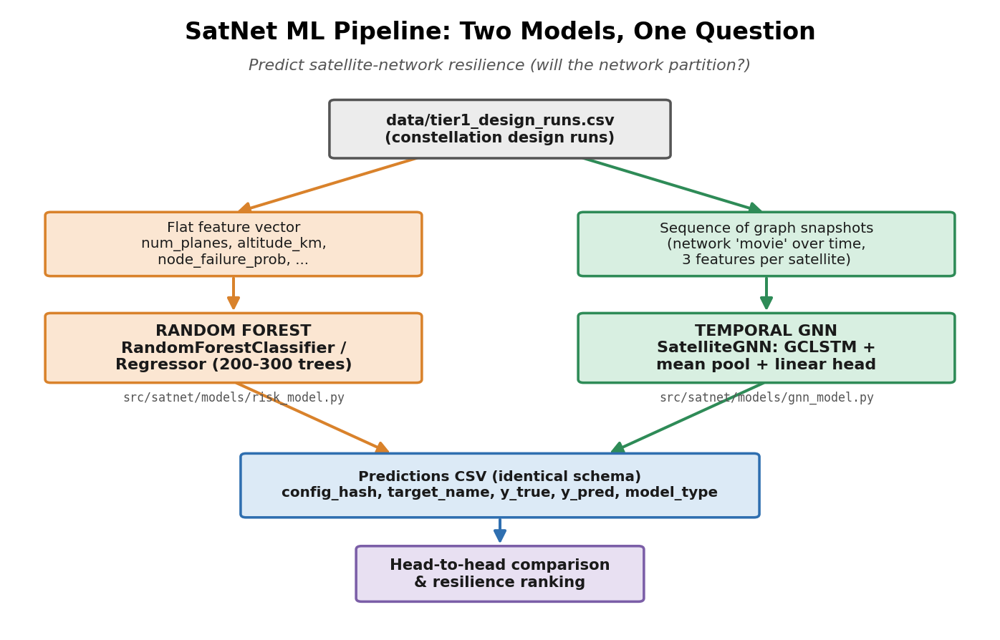
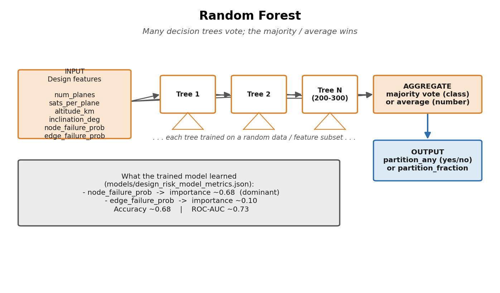
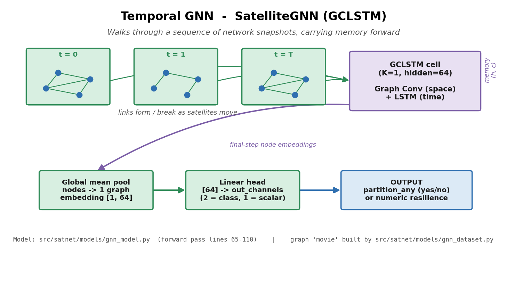

# Machine Learning in SatNet: Random Forest & Temporal Graph Neural Network

*A plain-language guide to the two ML models used in this repository, with the specific files and code lines that implement them.*

---

## 1. The Big Picture: What Are These Models Doing?

This repository (`satnet-arch-dss`) is a **decision-support system for satellite
constellation architecture**. When you design a constellation, you choose things
like how many orbital planes you have, how many satellites per plane, the orbit
altitude, and the inclination. A key question is: **if some satellites or links
fail, will the network stay connected, or will it split into disconnected
pieces (a "partition")?**

Both machine-learning models in this repo try to **predict network resilience**
from a constellation's design. They answer questions like:

- *"Will this design ever get partitioned?"* (a yes/no — **classification**)
- *"What fraction of the time is it partitioned?"* (a number — **regression**)

The two models attack the same problem from **two very different angles**:

| | **Random Forest** | **Temporal GNN (GCLSTM)** |
|---|---|---|
| How it sees the world | A flat row of numbers (design parameters) | A *movie* of the network graph evolving over time |
| Models time? | No | Yes |
| Models network topology? | No | Yes |
| Library | scikit-learn | PyTorch + PyTorch Geometric (Temporal) |
| Speed to train | Seconds | Much slower (processes graph sequences) |

Think of the Random Forest as a fast, smart "rule-of-thumb" engine, and the
Temporal GNN as a heavier model that actually "watches" satellites move and
links come and go before making its call.

Both models are deliberately built to be **interchangeable**: they read the
same data, support the same prediction targets, and write predictions in the
same format so their results can be compared head-to-head.



*Figure 1 — The shared pipeline. Both models start from the same CSV of
constellation runs, but the Random Forest sees a flat feature vector while the
Temporal GNN sees a sequence of network graphs. Their predictions land in an
identical CSV schema so they can be compared directly.*

---

## 2. Random Forest

### 2.1 What is a Random Forest? (the concept)

A **decision tree** is a flowchart of yes/no questions. For example:
*"Is the node-failure probability > 0.3? → Is altitude < 600 km? → Predict
PARTITIONED."* A single tree is easy to read but tends to **overfit** —
it memorizes the training data and generalizes poorly.

A **Random Forest** fixes this by training **many** decision trees (here, 200–300
of them), each on a random subset of the data and a random subset of the
features. To make a prediction, every tree "votes," and the forest returns the
majority vote (for classification) or the average (for regression). This
"wisdom of the crowd" makes the forest far more robust and accurate than any
single tree.

Two useful properties make it a great fit for this project:

1. **It needs almost no data preparation** — it works directly on raw numeric
   design parameters.
2. **It tells you which inputs matter** via *feature importances* — e.g., the
   repo's trained model found that `node_failure_prob` was by far the most
   important predictor.



*Figure 2 — Random Forest. Each design's feature vector is run through many
independent decision trees; their votes are aggregated into one prediction. The
box at the bottom shows what the repo's trained model actually learned.*

### 2.2 How it's used in this repo

The entire Random Forest implementation lives in one module:

> **`src/satnet/models/risk_model.py`**

**The library imports** (`src/satnet/models/risk_model.py:13-23`):

```python
from sklearn.ensemble import RandomForestClassifier, RandomForestRegressor
from sklearn.metrics import (
    accuracy_score, mean_absolute_error, mean_squared_error,
    r2_score, roc_auc_score, classification_report, confusion_matrix,
)
from sklearn.model_selection import train_test_split
```

It uses both flavors of the algorithm:
- `RandomForestClassifier` — for yes/no targets (e.g. *was it ever partitioned?*)
- `RandomForestRegressor` — for numeric targets (e.g. *what fraction of time?*)

#### The hyperparameters

The model's settings are collected in a small config object
(`src/satnet/models/risk_model.py:26-31`):

```python
@dataclass
class RiskModelConfig:
    test_size: float = 0.2        # hold out 20% of data to test on
    random_state: int = 42        # fixed seed → reproducible results
    n_estimators: int = 200       # number of trees in the forest
    max_depth: int | None = None  # let trees grow to full depth
```

- **`n_estimators = 200`** — how many trees. (The training *script* raises this
  to 300 by default — see §2.4.)
- **`max_depth = None`** — trees grow until leaves are pure; the ensemble
  averaging keeps overfitting in check.
- **`random_state = 42`** — guarantees the same result every run.
- **`test_size = 0.2`** — 80% train / 20% test split.

#### The inputs (features) and outputs (labels)

The model is fed a flat list of constellation design numbers
(`src/satnet/models/risk_model.py:39-49`):

```python
TIER1_V1_FEATURE_COLUMNS: List[str] = [
    "num_planes",
    "sats_per_plane",
    "total_satellites",
    "inclination_deg",
    "altitude_km",
    "node_failure_prob",
    "edge_failure_prob",
    "duration_minutes",
    "step_seconds",
]
```

There's also a "pure design" feature set that excludes failure probabilities,
for predicting risk from design alone
(`src/satnet/models/risk_model.py:52-57`).

The thing it predicts (the label) defaults to a binary partition flag
(`src/satnet/models/risk_model.py:60-63`):

```python
TIER1_V1_LABEL_COLUMN = "partition_any"          # binary: did it partition?
TIER1_V1_LABEL_COLUMN_ALT = "partition_fraction" # numeric: how much?
```

#### Where the model is actually built and trained

The unified training function `train_rf_model()`
(`src/satnet/models/risk_model.py:542-656`) is the modern entry point. It
**automatically decides** whether to build a classifier or a regressor based on
the chosen target:

```python
task_type = infer_task_type(target_name)   # ~line 569
```

Then it constructs the matching model. For **classification**
(`src/satnet/models/risk_model.py:589-595`):

```python
model = RandomForestClassifier(
    n_estimators=cfg.n_estimators,
    max_depth=cfg.max_depth,
    random_state=cfg.random_state,
    n_jobs=-1,                 # use all CPU cores
    class_weight="balanced",   # handle rare partition cases fairly
)
```

For **regression** (`src/satnet/models/risk_model.py:597-602`):

```python
model = RandomForestRegressor(
    n_estimators=cfg.n_estimators,
    max_depth=cfg.max_depth,
    random_state=cfg.random_state,
    n_jobs=-1,
)
```

The actual learning happens with a single scikit-learn call, `model.fit(...)`,
inside this function. Afterward the function returns the trained model, a
metrics dictionary, and a tidy predictions table whose `model_type` column is
stamped `"RandomForest"` (`src/satnet/models/risk_model.py:641`).

> **Note:** The file also contains several older, more specialized trainers —
> `train_design_risk_model()` (lines 133-180), `train_tier1_risk_model()`
> (lines 191-252), `train_tier1_v1_risk_model()` (lines 370-450), and
> `train_tier1_v1_design_model()` (lines 453-534) — kept for backward
> compatibility. They all build the same kind of `RandomForestClassifier`.

#### Saving and loading the trained model

The forest is saved to disk with `joblib`
(`src/satnet/models/risk_model.py:313-319`):

```python
def save_model(model, path):
    path.parent.mkdir(parents=True, exist_ok=True)
    joblib.dump(model, path)

def load_model(path):
    return joblib.load(path)
```

### 2.3 What the trained model actually learned

A trained model's metrics are stored at
**`models/design_risk_model_metrics.json`**. Highlights:

- **Accuracy:** ~0.68
- **ROC-AUC:** ~0.73
- **Most important feature by far:** `node_failure_prob` (importance ≈ **0.68**),
  followed distantly by `edge_failure_prob` (≈ 0.10).

In plain terms: the model learned that **how likely individual satellites are to
fail** dominates whether the network partitions — which is an intuitive,
reassuring result.

### 2.4 How you run it

The command-line entry point is
**`scripts/train_design_risk_model.py`**. Key options:

- `--target-name` — what to predict (default `partition_any`)
- `--n-estimators` — number of trees (**default 300** here)
- `--seed` — reproducibility (default 42)
- `--test-size` — train/test split (default 0.2)

It loads `data/tier1_design_runs.csv`, calls `train_rf_model()`, then saves the
model (`models/design_risk_model_tier1.joblib`), its metrics JSON, and a
predictions CSV. It also appends a record to an experiment log at
`experiments/rf_log.jsonl`.

---

## 3. Temporal Graph Neural Network (GCLSTM)

### 3.1 What is a Temporal GNN? (the concept)

To understand this model, build it up in two layers.

**Layer 1 — Graph Neural Network (GNN).** A satellite network is naturally a
**graph**: satellites are *nodes*, and the communication links between them
(inter-satellite links, or ISLs) are *edges*. A regular neural network can't
handle this irregular structure, but a **GNN** can. The core idea is **message
passing**: each node updates its understanding of itself by gathering
information from its neighbors. Stack a few of these and each satellite "knows"
about its local neighborhood — exactly the kind of connectivity information you
need to predict partitions.

**Layer 2 — adding *time*.** Satellites are constantly moving, so the network
graph **changes every minute**: links form when satellites come into range and
break when they drift apart. A single static graph can't capture this. A
**Temporal GNN** processes a **sequence** of graph snapshots (a "movie" of the
network), one per time step.

This repo uses a specific architecture called **GCLSTM** = **G**raph
**C**onvolutional **LSTM**. It marries two ideas:

- a **Graph Convolution** (the spatial part — "what's happening across the
  network right now?"), and
- an **LSTM** (the temporal part — a recurrent memory cell that carries
  information forward across time steps, "what's been happening as the network
  evolves?").

So at each time step, the model looks at the current network topology *and*
remembers what it saw at all previous steps. The repo's own docstring calls
this the **"Thesis Model."**



*Figure 3 — Temporal GNN forward pass. The GCLSTM cell consumes one network
snapshot at a time, carrying its memory `(h, c)` forward across time steps. The
final node embeddings are pooled into a single graph summary, which the linear
head turns into a prediction.*

### 3.2 How it's used in this repo

The model itself is defined in:

> **`src/satnet/models/gnn_model.py`**

**The imports** reveal the tech stack (`src/satnet/models/gnn_model.py:21-26`):

```python
import torch
import torch.nn as nn
import torch.nn.functional as F
from torch_geometric.data import Data
from torch_geometric.nn import global_mean_pool
from torch_geometric_temporal.nn.recurrent import GCLSTM
```

It uses **PyTorch** for the deep-learning machinery, **PyTorch Geometric** for
graph data structures, and **PyTorch Geometric Temporal** for the `GCLSTM`
layer itself.

#### The model architecture

The whole model is the `SatelliteGNN` class
(`src/satnet/models/gnn_model.py:29-63`). It is surprisingly compact — just two
learnable pieces (`src/satnet/models/gnn_model.py:59-63`):

```python
# GCLSTM: Graph Convolutional LSTM (K=1: 1-hop Chebyshev filter)
self.recurrent = GCLSTM(in_channels=node_features, out_channels=hidden_channels, K=1)

# Linear head: graph embedding → class logits or scalar
self.linear = nn.Linear(hidden_channels, out_channels)
```

The constructor's defaults (`src/satnet/models/gnn_model.py:42-48`):

```python
def __init__(
    self,
    node_features: int = 3,     # each satellite is described by 3 numbers
    hidden_channels: int = 64,  # size of the GCLSTM's "memory"
    out_channels: int = 2,      # 2 for yes/no, 1 for a numeric prediction
    task_type: Literal["classification", "regression"] = "classification",
):
```

- **`node_features = 3`** — each satellite carries 3 input numbers (see §3.3).
- **`hidden_channels = 64`** — the dimension of the GCLSTM's hidden/memory state.
- **`K = 1`** — the graph convolution looks **1 hop** out (immediate neighbors).
- **`out_channels`** — `2` for classification, `1` for regression.

#### The forward pass — how a prediction is computed

This is the heart of the model
(`src/satnet/models/gnn_model.py:65-110`). Read it as four steps:

**Step 1 — start with a blank memory** (`:88-89`):

```python
h: Optional[torch.Tensor] = None   # hidden state
c: Optional[torch.Tensor] = None   # cell state
```

**Step 2 — walk through the sequence of graph snapshots, one time step at a
time, updating the memory** (`:92-98`):

```python
for data in data_list:
    x = data.x                 # node features at this time step
    edge_index = data.edge_index  # which links exist right now
    edge_weight = getattr(data, "edge_weight", None)

    # GCLSTM updates its memory using the current graph
    h, c = self.recurrent(x, edge_index, edge_weight, h, c)
```

This loop **is** the "temporal" part — the memory `(h, c)` is threaded from one
snapshot to the next, so the final state summarizes the whole movie.

**Step 3 — collapse all the per-satellite embeddings into one
whole-network summary** (global mean pooling) (`:102-105`):

```python
num_nodes = h.size(0)
batch = torch.zeros(num_nodes, dtype=torch.long, device=h.device)
graph_embedding = global_mean_pool(h, batch)  # [1, hidden_channels]
```

**Step 4 — turn that summary into a prediction** (`:108-110`):

```python
logits = self.linear(graph_embedding)  # [1, out_channels]
return logits
```

There are two convenience wrappers for inference:
`predict()` returns a clean class index or scalar
(`src/satnet/models/gnn_model.py:112-124`), and `predict_proba()` returns
softmax probabilities for classification
(`src/satnet/models/gnn_model.py:126-135`).

#### Where the "movie" of graphs comes from

The model needs a sequence of graph snapshots per constellation. That's built
on the fly by:

> **`src/satnet/models/gnn_dataset.py`** — the `SatNetTemporalDataset` class
> (`src/satnet/models/gnn_dataset.py:61-143`).

For each row in the CSV, it reads the constellation's design, simulates the
orbits and computes which inter-satellite links exist at each time step, and
turns each snapshot into a PyTorch Geometric `Data` object. The key calls are
the orbit/link simulation (`src/satnet/models/gnn_dataset.py:321-334`) and the
conversion of each NetworkX graph into tensors
(`src/satnet/models/gnn_dataset.py:339-353`).

### 3.3 The 3 features each satellite carries

Inside the graph-building helper, every node (satellite) gets a 3-number
feature vector, normalized to the 0–1 range
(`src/satnet/models/gnn_dataset.py:383-397`):

```python
x = torch.zeros((num_nodes, 3), dtype=torch.float)
...
x[idx, 0] = plane_idx / max(num_planes - 1, 1)        # which orbital plane
x[idx, 1] = sat_in_plane / max(sats_per_plane - 1, 1) # position within plane
x[idx, 2] = 1.0                                        # "this node exists" flag
```

That's why `node_features = 3` in the model: plane index, position-in-plane, and
an existence flag.

### 3.4 How you run it

The training script is **`scripts/train_gnn_model.py`**. Notable defaults:

- `--epochs 20` — training passes over the data
- `--lr 0.01` — Adam optimizer learning rate
- `--hidden-dim 64` — must match the GCLSTM hidden size
- `--device auto` — picks CUDA GPU → Apple MPS → CPU automatically
- `--target-name partition_any` — what to predict

It builds the model with the right output size for the task
(`scripts/train_gnn_model.py:428-434`), picks the matching loss —
`CrossEntropyLoss` for classification or `SmoothL1Loss` for regression
(`scripts/train_gnn_model.py:442-446`) — and trains with Adam. It saves the best
checkpoint to `models/satellite_gnn.pt`, writes a predictions CSV (stamped
`model_type = "SatelliteGNN"`), and logs to `experiments/gnn_log.jsonl`.

---

## 4. How the Two Models Fit Together

The two models are **complementary tools for the same job**, designed so their
results are directly comparable:

1. **Same data source.** Both read constellation runs from
   `data/tier1_design_runs.csv`.

2. **Same prediction targets.** Both accept a `--target-name`, and both call the
   same `infer_task_type()` helper to decide classification vs. regression. So
   you can ask either model the *exact same question*.

3. **Same prediction output format.** Both write a predictions CSV with the same
   columns — `config_hash`, `target_name`, `task_type`, `seed`, `split`,
   `y_true`, `y_pred`, `model_type`, etc. The only difference is the
   `model_type` stamp (`"RandomForest"` vs `"SatelliteGNN"`). This lets you
   join their outputs and compare them fairly.

4. **Same experiment logging.** RF logs to `experiments/rf_log.jsonl`; the GNN
   logs to `experiments/gnn_log.jsonl`, with the same metadata fields.

**The trade-off:** The Random Forest is fast and interpretable but is "blind" to
both time and topology — it only sees a flat list of design numbers. The
Temporal GNN is heavier and slower but actually models the physics: it watches
the network topology evolve over time, which in principle lets it catch
resilience problems the flat model can't see. Running both and comparing them is
a core part of this project's methodology.

---

## 5. Quick File Reference

| What | File | Key lines |
|---|---|---|
| Random Forest config | `src/satnet/models/risk_model.py` | 26–31 |
| RF features / labels | `src/satnet/models/risk_model.py` | 39–63 |
| RF unified trainer | `src/satnet/models/risk_model.py` | 542–656 |
| RF save / load | `src/satnet/models/risk_model.py` | 313–319 |
| RF training script | `scripts/train_design_risk_model.py` | — |
| RF example metrics | `models/design_risk_model_metrics.json` | — |
| Temporal GNN model | `src/satnet/models/gnn_model.py` | 29–135 |
| GNN architecture | `src/satnet/models/gnn_model.py` | 59–63 |
| GNN forward pass | `src/satnet/models/gnn_model.py` | 65–110 |
| GNN dataset builder | `src/satnet/models/gnn_dataset.py` | 61–143 |
| GNN node features | `src/satnet/models/gnn_dataset.py` | 383–397 |
| GNN training script | `scripts/train_gnn_model.py` | — |
| ML dependencies | `pyproject.toml` | 22–26 |
| Diagram source | `docs/diagrams/generate_diagrams.py` | — |

---

*Generated for the `satnet-arch-dss` project. Line numbers refer to the code as
of this document's creation; if the code changes, re-check the citations.*
