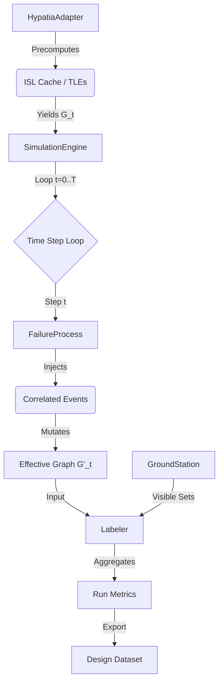

# Gemini's Refactor Plan: The "Hypatia Route" to Tier 1 Fidelity

**Executive Summary:**
The "Hypatia Route" represents a paradigm shift from **static snapshots** to **time-evolving simulations**. Our current codebase has a "Ferrari engine" (`HypatiaAdapter` with SGP4/LinkBudgets) inside a "Go-Kart" (`SimulationEngine` with static `t=0` logic). This refactor aligns the simulation loop with the physics capabilities we already possess, enabling the generation of the "Tier 1" datasets described in the research plans.

---

# 1. High-Level Analysis

## 1.1 The Gap: "Ferrari Engine in a Go-Kart"
*   **Strengths (The Ferrari):** `src/satnet/network/hypatia_adapter.py` is excellent. It already implements Tier 1 physics:
    *   **Orbital Propagation**: SGP4 w/ WGS72.
    *   **Link Physics**: Optical (1550nm) & RF (28GHz) budgets with Earth obscuration.
    *   **Dynamic ISLs**: Calculates links over time `t=0..T`.
*   **Weaknesses (The Go-Kart):** `src/satnet/simulation/engine.py` is stuck in `t=0`.
    *   It calls `get_graph_at_step(0)` once.
    *   It applies i.i.d. Bernoulli failures (toy model) on this single snapshot.
    *   It computes static graph metrics (components), missing temporal reliability (partition streaks).

## 1.2 The "Hypatia Route" Architecture
To bridge this gap, we must invert control. **Time** must drive the simulation.



## 1.3 Key Research Integrations
*   **Canonical Schema**: The output must match the "Tidy Data" Parquet schema defined in `research-plane2.md`.
*   **Grouped Splitting**: We must export `design_family_id` to prevent ML data leakage.
*   **Correlated Failures**: We move from `random.random() < 0.01` to `FailureProcess` state machines (Plane CCF, Storms).

---

# 2. Refactoring Roadmap (Atomic Steps)

This roadmap is designed for a junior engineer to execute sequentially. Each phase is deployable.

## Phase 1: The Time Loop & Temporal Labels (Core Plumbing)
**Goal:** Unlock the temporal data `HypatiaAdapter` already generates.

*   **Step 1.1: Create `metrics/labels.py`** (Pure Logic)
    *   **Input:** Iterable of `nx.Graph` (per timestep), iterable of `visible_sats` (sets).
    *   **Logic:** Compute `partition_fraction` (fraction of steps where GCC < threshold), `max_partition_streak`.
    *   **Reference:** `Tier1_Labels_Implementation_Plan.md`.
    *   **Test:** Unit test with a list of 3 simple mock graphs (connected -> disconnected -> connected).

*   **Step 1.2: Expose Graph Iterator in Adapter**
    *   **Action:** Add `iter_graphs(start, end, step)` to `HypatiaAdapter`.
    *   **Optimization:** Ensure it doesn't re-parse TLEs every call. Use the existing `_isl_data` cache.

*   **Step 1.3: Refactor `SimulationEngine.run()`**
    *   **Action:** Change `run()` to iterate:
        ```python
        for t, G_t in enumerate(self.adapter.iter_graphs()):
             # ... failure logic (placeholder for now) ...
             graphs.append(G_t)
        labels = label_run(graphs, ...)
        ```
    *   **Output:** Returns `SimulationResult` containing temporal labels.

## Phase 2: Ground Station Integration
**Goal:** Add "Reachability" to our reliability definition.

*   **Step 2.1: Ground Station Models**
    *   **Action:** Create `ground/models.py` with `GroundStation` dataclass (lat, lon, min_elevation).
    *   **Action:** Add `gateways` list to `SimulationEngine` config.

*   **Step 2.2: Geometric Visibility Provider**
    *   **Action:** Create `ground/visibility.py`.
    *   **Logic:** Use `HypatiaAdapter.get_positions_at_step(t)` (SGP4 ECEF) + `GroundStation` (ECEF) -> `elevation > min_el`.
    *   **Output:** `iter_gateway_visible_sats(adapter, gateways)` yielding `Set[sat_id]` per step.

*   **Step 2.3: Wire to Labeler**
    *   **Action:** Pass the visibility iterator to `metrics/labels.py`.
    *   **Metric:** Compute `avg_reachable_sat_frac` (multi-source BFS from visible sats).

## Phase 3: Correlated Failure Models (Tier 1 Physics)
**Goal:** Replace toy random failures with defensible physics-based models.

*   **Step 3.1: Failure Process Interface**
    *   **Action:** Create `models/failures.py`.
    *   **Interface:** `FailureProcess.step(t, dt, state) -> List[Event]`.
    *   **State:** Must track `node_status` (dead/alive) persistently across steps.

*   **Step 3.2: Implement Specific Models**
    *   **Plane CCF:** If `rand < beta`, fail all sats in `plane_id`. (Persistent).
    *   **Probabilistic ISL:** Use `Tier1_Probabilistic_ISL_Availability_Implementation_Plan.md`. Map `margin_db` (from Adapter) -> `P_drop`. (Transient per step).

*   **Step 3.3: Integrate into Engine Loop**
    *   **Action:** In `SimulationEngine` loop:
        1. Get `G_t` (raw topology).
        2. Apply persistent node failures (remove nodes).
        3. Apply transient link failures (remove edges based on probabilistic model).
        4. Pass `G_t_effective` to Labeler.

## Phase 4: Dataset Factory & ML Readiness
**Goal:** High-volume generation for the `research-plane2.md` schema.

*   **Step 4.1: Canonical Schema Export**
    *   **Action:** Update `scripts/export_design_dataset.py`.
    *   **Format:** Parquet (via `pyarrow` or `pandas`).
    *   **Columns:** Include `design_family_id` (e.g., `walker_53deg`), `config_hash`, `run_id`.

*   **Step 4.2: Reproducibility Lock**
    *   **Action:** Ensure `random_seed` controls:
        *   SGP4 propagation (if any stochastic drag).
        *   Failure injection (RNG).
        *   Graph generation.
    *   **Verify:** Running twice with seed `42` produces bit-identical Parquet rows.

---

# 3. Next Actions

**Immediate Task for Junior Engineer:**
Start with **Phase 1, Step 1.1**: Create `src/satnet/metrics/labels.py`. This is a pure function module that can be tested in isolation and unblocks the rest of the pipeline.
